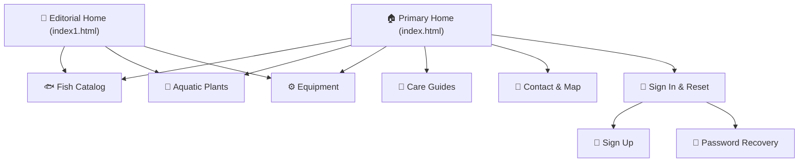

# 🐟 Stillwater Aquatics — Aquarium Fish & Aquatic Supplies

<div align="center">


<p align="center">
  <strong>An elegant, modern multi-page storefront and keeper hub for freshwater & marine livestock, aquatic plants, and specialized aquascaping gear.</strong>
</p>

<p align="center">
  <a href="#-key-features">Key Features</a> •
  <a href="#-quick-start">Quick Start</a> •
  <a href="#-pages-overview">Pages Overview</a> •
  <a href="#-tech-stack--architecture">Architecture</a> •
  <a href="#-design-system--tokens">Design System</a> •
  <a href="#-accessibility">Accessibility</a>
</p>

---

</div>

## 🌊 Overview

**Stillwater Aquatics** is a responsive, lightweight, zero-dependency multi-page web application designed for boutique aquarium stores and passionate aquarists. Built with clean semantic HTML5, modern CSS custom properties, and modular vanilla JavaScript, it delivers high performance and refined visual aesthetics with zero build steps or package managers required.

---

## ✨ Key Features

| Feature | Description |
| :--- | :--- |
| ⚡ **Zero-Build Architecture** | Runs out of the box with pure static files. No Webpack, Vite, or npm installs required. |
| 🌓 **Adaptive Light / Dark Modes** | System-aware color scheme with instantaneous manual toggle and persistent state storage. |
| 🔄 **Bidirectional LTR / RTL Support** | Seamless Right-to-Left language layout mirroring and directional controls. |
| 🔍 **Real-Time Live Search & Filters** | Instant client-side search and category filtering for livestock and equipment. |
| 🪟 **Interactive Specimen Modals** | Popups with water chemistry parameters, care tips, stock availability, and reservation links. |
| 🔐 **Account & Form Validation** | Client-side validation for Sign In, Sign Up, Special Orders, and Newsletter subscriptions. |
| 🔑 **Forgot Password Recovery** | Accessible modal dialog with email verification flow and client feedback states. |
| 🗺️ **Interactive Store Map** | Local map interface with quick view switching, zoom controls, and directions. |
| 📱 **Mobile-First Experience** | Responsive drawer navigation, touch-friendly tap targets, and smooth scroll reveals. |
| 🖼️ **Optimized WebP Assets** | High-resolution, lightweight photography embedded locally for rapid page loads. |

---

## 🚀 Quick Start

No compilation, bundler, or package manager needed. Open the project directly or run a lightweight local static server:

### Option 1: Direct Browser Launch
Double click `index.html` or drag it into any modern web browser.

### Option 2: Local Static Server

```bash
# Using Python 3 (Recommended)
python3 -m http.server 8000

# Or using Node.js npx
npx serve .

# Or using PHP built-in server
php -S localhost:8000
```

Visit [`http://localhost:8000`](http://localhost:8000) in your browser.

---

## 📁 File Structure

```text
11 Aquarium Fish & Aquatic Supplies Store/
├── 📄 index.html                  # Primary Homepage (Hero, Featured Stock, Trust Pillars)
├── 📄 index1.html                 # Alternate Editorial & Habitat-focused Homepage
├── 📄 README.md                   # Project documentation & reference
│
├── 📂 pages/                      # Storefront and utility subpages
│   ├── 📄 fish-catalog.html       # Livestock catalog with live search & specimen popups
│   ├── 📄 aquatic-plants.html     # Aquascaping plants, difficulty badges & care notes
│   ├── 📄 equipment.html          # Filtration, lighting, CO2 systems & gear sizing FAQ
│   ├── 📄 care-guides.html        # Water cycling guides, chemistry tips & keeper FAQs
│   ├── 📄 about.html              # Welfare philosophy, sourcing ethics & store story
│   ├── 📄 contact.html            # Interactive map, hours, location & special order form
│   ├── 📄 signin.html             # Keeper login with show/hide password & Forgot Password modal
│   ├── 📄 signup.html             # Keeper registration with password confirmation
│   ├── 📄 privacy.html            # Privacy policy & local storage disclosures
│   ├── 📄 terms.html              # Terms of service & livestock guidelines
│   ├── 📄 coming-soon.html        # Pre-launch placeholder state
│   └── 📄 404.html                # Error page with navigation recovery
│
└── 📂 assets/                     # Styles, scripts, and local media
    ├── 📂 css/
    │   ├── 📄 style.css           # Core styles, design tokens, typography & components
    │   ├── 📄 dark-mode.css       # Dark theme variables, contrast and surface overrides
    │   └── 📄 rtl.css             # Right-to-left layout transformations and mirroring
    ├── 📂 js/
    │   ├── 📄 main.js             # Navigation, theme/RTL toggles, filters, modals & validation
    │   └── 📄 lucide.min.js       # Vendored Lucide icon library
    └── 📂 images/                 # Local high-resolution WebP photographs & SVG brand assets
```

---

## 🧭 Pages Overview



### 🐠 Livestock & Storefront Pages
- **`index.html`** — Primary storefront with hero highlights, 14-day health guarantee banner, featured specimens with modal previews, and habitat spotlights.
- **`index1.html`** — Alternate editorial home emphasizing biotope categories (Freshwater, Marine, Planted Aquascapes).
- **`pages/fish-catalog.html`** — Real-time filterable livestock catalog with category badges, instant search, stock indicators, and specimen detail overlays.
- **`pages/aquatic-plants.html`** — Catalog of tissue-cultured and potted aquatic plants categorized by light/CO2 demand.
- **`pages/equipment.html`** — Curated gear including canister filters, LED lighting, hardscape stones, and CO2 injection kits.

### 📚 Education & Discovery
- **`pages/care-guides.html`** — Practical guides for the Nitrogen cycle, water chemistry benchmarks, and interactive accordions.
- **`pages/about.html`** — Sourcing standards, quarantine protocols, and store ethos.
- **`pages/contact.html`** — Store location in Bengaluru, opening schedule, interactive map with zoom controls, and custom livestock order form.

### 🔐 Keeper Authentication
- **`pages/signin.html`** — Account login with show/hide password toggle and a built-in **Forgot Password Recovery Modal**.
- **`pages/signup.html`** — New keeper account registration with live field validation and matching password confirmation.

---

## 🎨 Design System & Tokens

The visual language balances calm botanical deep greens, warm sand papers, and vibrant aquatic coral accents.

| Token | Light Theme | Dark Theme | Purpose |
| :--- | :--- | :--- | :--- |
| `--paper` | `#f6f4ed` | `#0b1c18` | Base page canvas background |
| `--surface-card` | `#ffffff` | `rgba(16, 38, 33, 0.78)` | Card elevation and panels |
| `--ink` | `#0e2620` | `#f1f0e8` | Primary high-contrast text |
| `--ink-soft` | `#3d5950` | `#9fb2ab` | Secondary / muted text |
| `--kelp` | `#265a4b` | `#d5eca3` | Botanical brand identity |
| `--oxygen` | `#3d8b72` | `#b8d56a` | Accent borders and highlights |
| `--coral` | `#e05a3c` | `#ff8d70` | Primary buttons & interactive CTA |

---

## ♿ Accessibility & Performance

- **WCAG 2.1 AA Compliance**: High-contrast ratios verified across both light and dark themes.
- **Keyboard Navigation**: Fully accessible modals with focus trapping, `Escape` key listeners, and focus restoration.
- **Screen Reader Support**: Semantic landmarks (`<main>`, `<nav>`, `<header>`, `<article>`), ARIA labels, `aria-expanded`, and `role="dialog"` attributes.
- **Motion Preferences**: Respects `prefers-reduced-motion` media query to disable intensive animations.
- **Asset Optimization**: Local WebP images with explicit dimensions to eliminate Cumulative Layout Shift (CLS).

---

## 🛠️ Credits & Attribution

- **Icons**: [Lucide Icons](https://lucide.dev/) (ISC License) — Vendored locally in `assets/js/lucide.min.js`.
- **Fonts**: System-native font stack for instant zero-latency rendering.
- **Photography**: Custom curated aquatic imagery stored in `assets/images/`.

---

<div align="center">
  <small>© Stillwater Aquatics. Designed for tranquil aquascapes and thriving aquatic life.</small>
</div>
