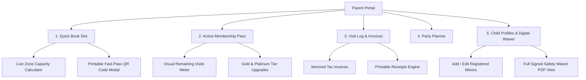

<div align="center">

# 🎪 PLAY ZONE — Kids Play Zone & Indoor Play Area

<p align="center">
  <strong>A modern, responsive, multipurpose multi-page web platform engineered for indoor playgrounds, family entertainment centers, and soft play arenas.</strong>
</p>

<p align="center">
  
  
  
  
  
  
  
</p>

---

[🚀 Explore Features](#-key-features-showcase) •
[📱 Pages Overview](#-pages--sitemap) •
[🎨 Design System](#-design-system--tokens) •
[⚡ Quick Start](#-quick-start) •
[💻 Interactive Portal](#-interactive-parent-portal-dashboard) •
[📁 File Structure](#-project-structure)

---

</div>

<br>

## 🌟 Executive Overview

**PLAY ZONE** is an enterprise-grade, lightweight, dependency-free frontend website crafted specifically for modern indoor play centers. Styled after vibrant **geometric Bauhaus playground aesthetics**, the site pairs bold visual design (arch cutouts, contrasting color blocks, and vector illustrations) with robust interactive utility including real-time slot bookings, digital safety waiver verification, printable invoices, and membership tier management.

```
┌──────────────────────────────────────────────────────────────────────────────────────────┐
│                                                                                          │
│   🔵 Royal Blue (#0D5BE1)  •  🔴 Energetic Red (#E52E2E)  •  🟡 Sunny Yellow (#F5B300)    │
│                                                                                          │
│   ✨ 13 Handcrafted Multi-Page HTML Views                                                 │
│   ✨ Real-Time Parent Portal & Slot Availability Engine                                   │
│   ✨ Full Dark Mode & RTL (Right-to-Left) Language Mirroring                             │
│   ✨ Zero Frameworks • Pure Native Vanilla Web Tech (Fast, Portable & SEO-Ready)          │
│                                                                                          │
└──────────────────────────────────────────────────────────────────────────────────────────┘
```

---

## 🚀 Key Features Showcase

<table>
  <tr>
    <td width="50%" valign="top">
      <h3>🎟️ Live Slot Engine & Booking</h3>
      <ul>
        <li>Real-time capacity tracking across all 4 play zones.</li>
        <li>Dynamic multi-child pass calculator with grip socks add-ons.</li>
        <li>Instant checkout with modal QR Pass generation for fast gate entry.</li>
      </ul>
    </td>
    <td width="50%" valign="top">
      <h3>💳 Digital Membership Management</h3>
      <ul>
        <li>Interactive Gold Explorer & Platinum VIP membership tracker.</li>
        <li>Live session usage meter bar (e.g. <em>8 of 12 visits remaining</em>).</li>
        <li>One-click in-place tier renewal and upgrade workflow.</li>
      </ul>
    </td>
  </tr>
  <tr>
    <td width="50%" valign="top">
      <h3>📝 Official Digital Safety Waiver</h3>
      <ul>
        <li>Legally binding digital safety release modal with 2FA verification.</li>
        <li>Multi-child coverage selector and verified digital signature box.</li>
        <li>Integrated browser printing & PDF export engine (<code>window.print()</code>).</li>
      </ul>
    </td>
    <td width="50%" valign="top">
      <h3>🎂 Birthday Party Customizer</h3>
      <ul>
        <li>Live party quotation calculator with guest slider (10–40 kids).</li>
        <li>Interactive theme switcher (Cosmic Glow, Superhero, Safari Jungle).</li>
        <li>Custom add-ons: balloon arches, 2-tier themed cake, mascot appearances.</li>
      </ul>
    </td>
  </tr>
  <tr>
    <td width="50%" valign="top">
      <h3>🌓 Complete Dark & Light Theme</h3>
      <ul>
        <li>Instant toggle with smooth transition and persistent state.</li>
        <li>Dark mode palette optimized for battery efficiency and night viewing.</li>
        <li>Automatic fallback to user's OS color scheme preference.</li>
      </ul>
    </td>
    <td width="50%" valign="top">
      <h3>🌍 Global RTL (Right-to-Left) Support</h3>
      <ul>
        <li>1-click LTR/RTL layout direction switcher.</li>
        <li>Full horizontal mirroring for Arabic, Hebrew, and Urdu layouts.</li>
        <li>Comprehensive CSS directional rules with mirrored typography and icons.</li>
      </ul>
    </td>
  </tr>
</table>

---

## 📱 Pages & Sitemap

| # | Page File | Route | Description |
|---|---|---|---|
| 1 | **Home 1** | `index.html` | Flagship homepage featuring geometric Bauhaus hero, highlight pills, zones showcase, and quick parent portal widget. |
| 2 | **Home 2** | `index1.html` | Interactive alternative home with live slot search bar, today's schedule timetable, and interactive attraction map. |
| 3 | **Play Zones** | `pages/play-zones.html` | Comprehensive breakdown of the 4 age-specific zones (Baby, Explorer, Adventure, Ninja) with safety rules and specs. |
| 4 | **Birthday Parties** | `pages/birthday-parties.html` | Party package tiers (Mini Bash, Super Party, VIP Royale), themed suite gallery, and instant party booking planner. |
| 5 | **Membership Plans** | `pages/membership-plans.html` | Transparent monthly & annual pricing tables, perk comparison matrix, and instant signup triggers. |
| 6 | **Safety Standards** | `pages/safety-standards.html` | BIS certification, UV-C sanitization protocol, mandatory anti-skid socks policy, and First Aid staff credentials. |
| 7 | **Parent Dashboard** | `pages/dashboard.html` | Central hub for bookings, digital member passes, invoice history, child profiles, and signed safety waivers. |
| 8 | **About Us** | `pages/about.html` | Facility journey, stats counter (50,000+ happy kids), play coaches, clean safety credentials, and brand values. |
| 9 | **Contact & Location** | `pages/contact.html` | Interactive stylized SVG location map, live operation hours, transit/parking guide, and validated contact form. |
| 10 | **Sign In** | `pages/signin.html` | Secure parent portal authentication with 1-click Demo credentials auto-fill and password show/hide toggles. |
| 11 | **Sign Up** | `pages/signup.html` | Streamlined family registration form with child profile setup and integrated digital waiver check. |
| 12 | **Coming Soon** | `pages/coming-soon.html` | Glow Laser Arena expansion announcement with real-time countdown timer and VIP early-access email form. |
| 13 | **404 Not Found** | `pages/404.html` | Playful Bauhaus 404 error page with navigation shortcuts and search quick-links. |
| 14 | **Privacy Policy** | `pages/privacy.html` | Child data protection (COPPA compliance), 24/7 CCTV storage rules, and data handling standards. |
| 15 | **Terms & Conditions** | `pages/terms.html` | Facility admission policy, socks requirement, booking cancellation, and parent supervision rules. |

---

## 🎨 Design System & Tokens

### Color Palette

| Token | Hex Code | Visual Preview | Usage |
|---|---|---|---|
| `--primary-blue` | `#0D5BE1` |  | Primary Brand Buttons, Active States, Key Accents |
| `--accent-red` | `#E52E2E` |  | CTAs, Special Highlights, Alert Badges, Geometric Dots |
| `--accent-yellow` | `#F5B300` |  | Gold Explorer Pass, Toddler Badges, Geometric Shapes |
| `--accent-green` | `#059669` |  | Verified Status, Active Waivers, Safe Badges |
| `--bg-body` (Light) | `#F8FAFC` |  | Primary Canvas Background |
| `--bg-surface` (Dark) | `#161F30` |  | Dark Mode Elevated Cards & Modals |

### Typography
- **Headings**: `Outfit`, system sans-serif (Weights: `800`, `900`) — Bold, energetic, modern geometric rhythm.
- **Body & Controls**: `Plus Jakarta Sans`, system-ui (Weights: `400`, `500`, `600`, `700`) — Clean legibility and high contrast.

---

## 💻 Interactive Parent Portal (Dashboard)

The Parent Portal (`pages/dashboard.html` + `assets/js/dashboard.js`) is an interactive single-page application (SPA-like experience) built completely with Vanilla JS:



---

## 📁 Project Structure

```
7 Kids Play Zone & Indoor Play Area/
├── index.html                  # Homepage 1 (Flagship Hero Layout)
├── index1.html                 # Homepage 2 (Interactive Slot Search Layout)
├── README.md                   # Project Documentation
├── assets/
│   ├── css/
│   │   ├── style.css           # Core Design Tokens, Typography, Layouts & Modals
│   │   ├── dark-mode.css       # Complete Dark Theme Palette & High-Contrast Overrides
│   │   └── rtl.css             # Right-to-Left Layout Direction & Mirroring Rules
│   ├── js/
│   │   ├── main.js             # Theme & RTL Switches, Mobile Drawer, Forms, Toasts
│   │   └── dashboard.js        # Slot Booking Engine, Pass Upgrades, Waiver System
│   └── images/                 # Optimized Vector Graphics & Playground Assets
│       ├── baby-zone.svg       # Baby Zone (0-2 Yrs) Visual
│       ├── explorer-zone.svg   # Explorer Zone (2-4 Yrs) Visual
│       ├── adventure-zone.svg  # Adventure Zone (4-8 Yrs) Visual
│       ├── challenge-zone.svg  # Ninja Challenge (8-14 Yrs) Visual
│       ├── hero-boy-slide.svg  # Bauhaus Arch Slide Illustration
│       └── ...
└── pages/
    ├── play-zones.html         # 4 Specialized Age Zones
    ├── birthday-parties.html   # Party Packages & Theme Selector
    ├── membership-plans.html   # Monthly/Annual Pricing Tiers
    ├── safety-standards.html   # Sanitization & Grip Socks Rules
    ├── dashboard.html          # Full Parent Portal Dashboard
    ├── about.html              # Our Mission, Facility Stats & Team
    ├── contact.html            # Working Hours, Interactive Map & Form
    ├── signin.html             # Parent Sign In (Demo Credentials Ready)
    ├── signup.html             # Family Registration & Child Profiles
    ├── 404.html                # Custom Animated 404 Not Found
    ├── coming-soon.html        # Glow Laser Arena with Live Countdown
    ├── privacy.html            # COPPA & CCTV Data Policy
    └── terms.html              # Facility Rules & Entry Agreement
```

---

## ⚡ Quick Start

No Node.js build process, bundler, or dependencies required! 

### Option 1: Direct File Launch
Simply open `index.html` or `index1.html` in any modern web browser.

### Option 2: Local HTTP Server

```bash
# Using Python 3
python3 -m http.server 8080

# Using Node npx
npx serve .

# Using PHP
php -S localhost:8080
```

Once running, navigate to `http://localhost:8080` in your browser.

---

## 🌐 Responsive Breakpoints

| Device Category | Viewport Width | Behavior |
|---|---|---|
| **Large Desktop** | `> 1280px` | Full multi-column Bauhaus grids, spacious hero section, sticky header. |
| **Standard Desktop** | `1024px – 1280px` | Optimized desktop layout with responsive container widths. |
| **Tablet View** | `641px – 1024px` | Hamburger drawer active; top navigation retains key action buttons. |
| **Mobile Devices** | `≤ 640px` | Fully fluid single-column layout, compact headers, touch-friendly modals. |

---

## ♿ Accessibility & Standards

- **Semantic HTML5**: Native elements (`<main>`, `<header>`, `<nav>`, `<aside>`, `<section>`, `<article>`, `<dialog>/modal`).
- **ARIA Best Practices**: `aria-expanded`, `aria-controls`, `aria-label`, `role="dialog"`, and `aria-modal="true"`.
- **Keyboard Friendly**: Full tab navigation order with distinct `:focus-visible` focus rings.
- **Color Contrast**: All primary text and interactive badges satisfy WCAG 2.1 AA contrast ratios (minimum `4.5:1` for normal text).

---

## 📜 Credits & Attributions

- **Typography**: [Outfit](https://fonts.google.com/specimen/Outfit) & [Plus Jakarta Sans](https://fonts.google.com/specimen/Plus+Jakarta+Sans) via Google Fonts (Open Font License).
- **Icons**: [Font Awesome 6 Free](https://fontawesome.com/) (CC BY 4.0).
- **Artwork**: Custom vector illustrations designed with geometric Bauhaus principles.

---

<div align="center">
  <sub>&copy; 2026 PLAY ZONE Indoor Play Area. Built for modern family entertainment centers.</sub>
</div>
